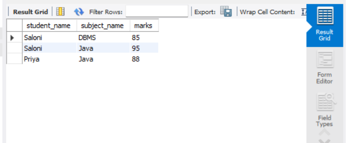
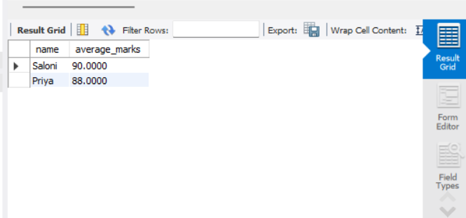
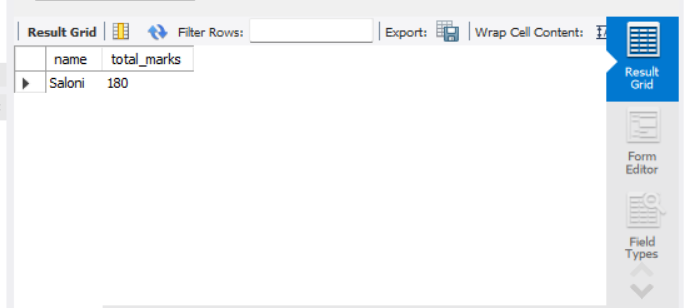

# Student Management System (SQL)

## 📌 Overview
This project demonstrates a simple relational database system to manage students, subjects, and marks using SQL.

## 🧱 Database Structure
- Students table
- Subjects table
- Marks table (with foreign keys)

## ⚙️ Features
- CRUD operations
- JOIN queries
- Aggregate functions (AVG, SUM)

## 🛠️ Tools Used
- MySQL Workbench

## 🚀 How to Run
1. Run schema.sql
2. Run data.sql
3. Run queries.sql

## 📊 Sample Queries
- Fetch student marks using JOIN
- Calculate average marks
- Find top-performing student

## 👩‍💻 Author
Saloni Rathore

## 📸 Output Screenshots

